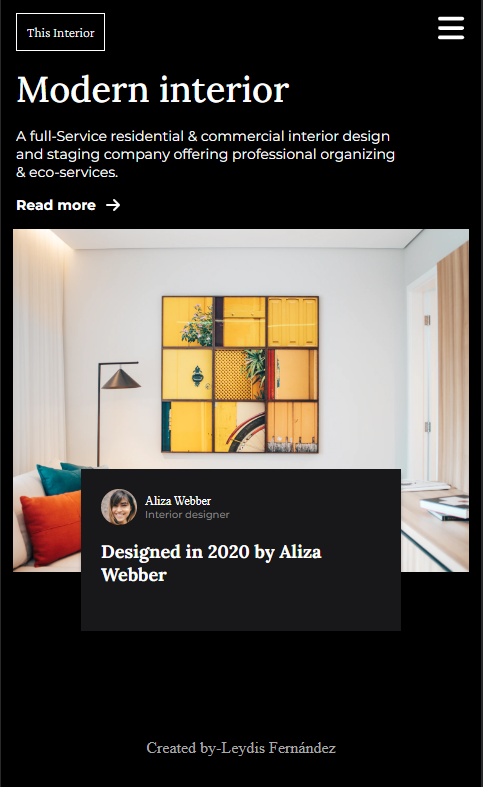
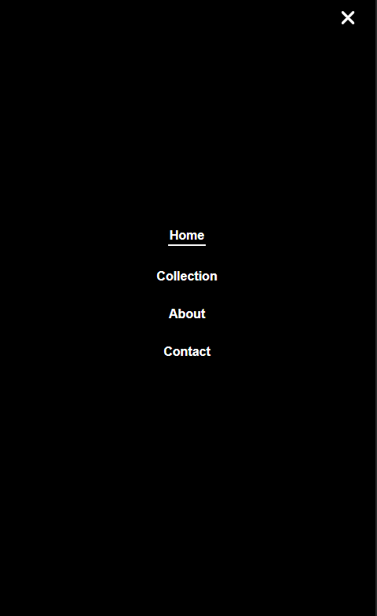

<!-- Please update value in the {}  -->

<h1 align="center">{ Interior Consultant }</h1>

   Solution for a challenge from  <a href="http://devchallenges.io" target="_blank">Devchallenges.io</a>.

  <h3>
    <a href="https://interior-consultant-ten-drab.vercel.app/">
      Demo
    </a>
     | 
    <a href="https://devchallenges.io/challenges/Jymh2b2FyebRTUljkNcb">
      Challenge
    </a>
  </h3>

<!-- TABLE OF CONTENTS -->

## Table of Contents

- [Overview](#overview)
  - [Built With](#built-with)
- [Features](#features)
- [Contact](#contact)
- [Acknowledgements](#acknowledgements)

<!-- OVERVIEW -->

## Overview

   

 
 

During the execution of this project, I was able to put into practice some technical skills and knowledge that allowed me to successfully develop this website using only **HTML** and **CSS**.

I implemented display flex and display grid, two CSS properties that are essential for creating responsive web designs. These tools allowed me to control the layout and arrangement of elements on the page, resulting in a visually appealing and easy-to-navigate website.

For the mobile version of the site, I designed a side menu. This menu is activated when the user clicks on the menu icon, providing easy and intuitive navigation.

The entire project was based on a design already established in **Figma**, a user interface design tool. This involved translating a static design into a functional website, requiring a solid understanding of how design elements are translated into code.
 
### Built With

<!-- This section should list any major frameworks that you built your project using. Here are a few examples.-->

- [HTML](https://html.org/)
- [CSS](https://css.org/)

## Features

<!-- List the features of your application or follow the template. Don't share the figma file here :) -->

This application/site was created as a submission to a [DevChallenges](https://devchallenges.io/challenges) challenge. The [challenge](https://devchallenges.io/challenges/Jymh2b2FyebRTUljkNcb) was to build an application to complete the given user stories.

## Acknowledgements

<!-- This section should list any articles or add-ons/plugins that helps you to complete the project. This is optional but it will help you in the future. For exmpale -->

- [Steps to replicate a design with only HTML and CSS](https://devchallenges-blogs.web.app/how-to-replicate-design/)
- [Node.js](https://nodejs.org/)
- [Marked - a markdown parser](https://github.com/chjj/marked)

## Contact

- GitHub [@leydisfh](https://github.com/leydisfh)
- Linkedin [@leydis-fernandez](https://linkedin.com/in/leydis-fernández)
